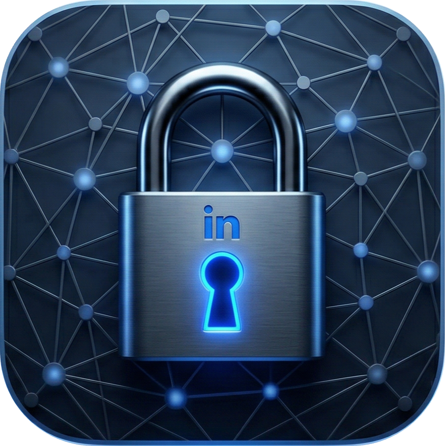

<div align="center">
  

  # LockedIn

  **Local LinkedIn browser automation scheduler for macOS**
</div>

---

## Download & Install

### Option 1 — Pre-built DMG (Recommended)

1. Go to the [Releases](../../releases) page and download the latest `LockedIn-<version>-arm64.dmg`
2. Open the `.dmg` file
3. Drag **LockedIn** into your **Applications** folder
4. **First launch:** right-click the app → **Open** (macOS will ask you to confirm since the build is unsigned — this is a one-time step)
5. LockedIn lives in your **menu bar** — look for the icon in the top-right of your screen

### Option 2 — Build from Source

**Requirements:** Node.js 18+, npm

```bash
git clone <repo-url>
cd locked-in
npm install
npm run dist:dmg
```

The `.dmg` will be built into the `dist/` folder. Open it and follow the same install steps above.

---

## Development

```bash
npm install      # install dependencies
npm run dev      # start in dev mode (Electron + Vite hot reload)
npm run build    # build renderer + main
npm test         # run tests
```

---

## About

LockedIn runs entirely on your machine — no cloud, no accounts, and no LinkedIn API integration. It automates your logged-in LinkedIn browser session with AppleScript and in-page JavaScript from a native macOS menu bar app: open the saved profile URL, click **Message**, type into the compose box, then click **Send**.

Browser support is based on Chrome/Chromium-style AppleScript control on macOS. Google Chrome is the default and tested browser, and other browsers are only expected to work if they expose the same AppleScript window/tab model.
